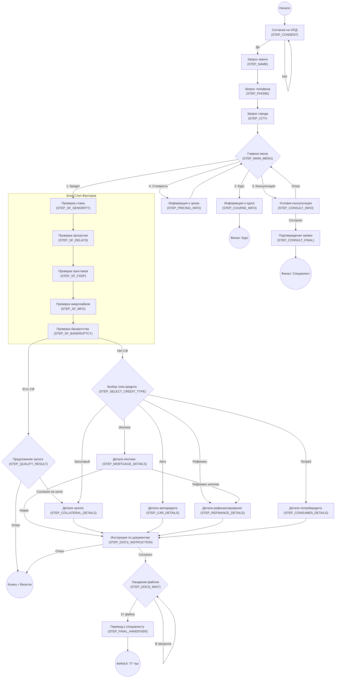

# Сценарий работы AI-ассистента (Татьяна) - Томское кредитное бюро

Данный документ описывает сценарную логику, этапы диалога, условия переходов и действия бота на базе LangGraph.

---

## Системные правила и глобальная логика

Перед детальным описанием этапов важно учитывать три базовых механики, работающих "поверх" сценария:

1.  **Приоритет файлов (Global Shortcut):** В любой момент диалога, если в систему поступает 3 и более PDF-файла (отчета БКИ), бот прерывает текущий этап и мгновенно переходит к `STEP_FINAL_HANDOVER`.
2.  **Принцип "Один ответ — один вопрос":** Агенту запрещено задавать более одного вопроса за один ход. Если клиент уходит от темы (`off_topic`) или задает встречный вопрос, бот кратко отвечает и **обязательно** дублирует текущий вопрос сценария.
3.  **Динамическая воронка CRM:** Бот автоматически определяет целевую воронку в amoCRM на основе выбора в Главном меню:
    - `direction: credit` -> Воронка "ИИ (Основная)" (ID: 10559694)
    - `direction: course` -> Воронка "Авторский курс" (ID: 9757870)
    - `direction: consult` -> Воронка "Платная консультация" (ID: 10740002)

---

## Визуализация графа сценариев

---

## 1. Блок: Входная анкета (Базовые данные)

На этом этапе бот приветствует клиента, получает согласие на обработку данных и собирает минимально необходимую информацию для идентификации.

### Этап 1: Согласие на ОПД (`STEP_CONSENT`)
- **Технический ID:** `STEP_CONSENT`
- **Описание:** Первое касание. Бот представляется и запрашивает юридическое согласие.
- **Логика бота:**
    - **Генерация (AI-2):** В первом сообщении отправляет полный текст приветствия со ссылкой на политику конфиденциальности. Если после первого сообщения клиент выражает недовольство/несогласие — бот вежливо повторяет требование.
    - **Анализ (AI-1):** Ожидает подтверждения. Валидными ответами считаются: "Да", "Ок", "Согласен", "+", "Хорошо", "Продолжаем".
- **Переходы:**
    - **Успех:** Переход к `STEP_NAME`.
    - **Отказ/Непонимание:** Остается на текущем этапе.
- **Действия:** В `extracted_data` фиксируется `consent_given = True`.

### Этап 2: Имя пользователя (`STEP_NAME`)
- **Технический ID:** `STEP_NAME`
- **Описание:** Получение имени для персонализации.
- **Логика бота:**
    - **Генерация (AI-2):** "Как я могу к вам обращаться? Напишите пожалуйста ваше имя."
    - **Анализ (AI-1):** Извлекает имя из текста.
- **Переходы:**
    - **Успех:** Переход к `STEP_PHONE`.
- **Действия:** Сохраняет имя в `extracted_data['name']`.

### Этап 3: Номер телефона (`STEP_PHONE`)
- **Технический ID:** `STEP_PHONE`
- **Описание:** Сбор контактного телефона.
- **Логика бота:**
    - **Генерация (AI-2):** "Напишите, пожалуйста, ваш контактный номер телефона."
    - **Анализ (AI-1):** Ищет в сообщении 10-12 цифр.
- **Переходы:**
    - **Успех:** Переход к `STEP_CITY`.
- **Действия:** Сохраняет телефон в `extracted_data['phone']`.

---

### Этап 4: Город проживания (`STEP_CITY`)
- **Технический ID:** `STEP_CITY`
- **Описание:** Завершающий этап сбора базовых данных.
- **Логика бота:**
    - **Генерация (AI-2):** "В каком городе вы сейчас проживаете?"
    - **Анализ (AI-1):** Извлекает название города.
- **Переходы:**
    - **Успех:** Переход к `STEP_MAIN_MENU`.
- **Действия:** Сохраняет город в `extracted_data['city']`.

---

## 2. Блок: Главное меню и разветвление

### Этап 5: Главное меню (`STEP_MAIN_MENU`)
- **Технический ID:** `STEP_MAIN_MENU`
- **Описание:** Точка выбора дальнейшего сценария.
- **Логика бота:**
    - **Генерация (AI-2):** Выводит список из 4-х пунктов (Кредит, Курс, Консультация, Цены).
    - **Анализ (AI-1):** Определяет выбранный пункт (`credit`, `course`, `consult`, `pricing`).
- **Переходы:**
    - **1 (Кредит):** Переход к блоку проверки стоп-факторов (`STEP_SF_SENIORITY`).
    - **2 (Курс):** Переход к `STEP_COURSE_INFO`.
    - **3 (Консультация):** Переход к `STEP_CONSULT_INFO`.
    - **4 (Стоимость):** Переход к `STEP_PRICING_INFO`.
- **Действия:** Сохраняет выбор в `extracted_data['direction']`.

---

## 3. Блок: Информационные ветки (Курс, Консультация, Цены)

### Этап 6: Авторский курс (`STEP_COURSE_INFO`)
- **Технический ID:** `STEP_COURSE_INFO`
- **Описание:** Выдача ссылки на курс и завершение.
- **Логика бота:**
    - **Генерация (AI-2):** Отправляет ссылку `{course_link}`.
- **Переходы:**
    - **Финал:** Завершение диалога (`is_completed: true`).
- **Действия:** Устанавливает `final_destination = "course"`.

### Этап 7: Платная консультация (`STEP_CONSULT_INFO`)
- **Технический ID:** `STEP_CONSULT_INFO`
- **Описание:** Предложение платной услуги за 10 000 руб.
- **Логика бота:**
    - **Генерация (AI-2):** Описывает формат и стоимость. Спрашивает согласие на оплату.
    - **Анализ (AI-1):** Извлекает `agree_to_pay`.
- **Переходы:**
    - **Согласие:** Переход к `CONSULT_FINAL`.
    - **Отказ:** Возврат в Главное меню.
- **Действия:** Устанавливает `final_destination = "consultation"`.

### Этап 8: Стоимость услуг (`STEP_PRICING_INFO`)
- **Технический ID:** `STEP_PRICING_INFO`
- **Описание:** Справочная информация по ценам.
- **Логика бота:**
    - **Генерация (AI-2):** Сообщает расценки и спрашивает, готов ли клиент выбрать направление.
- **Переходы:**
    - **Успех:** Возврат в Главное меню.

---

## 4. Блок: Ветка "Кредитование" (Проверка стоп-факторов)

### Этап 9: Проверка стажа (`STEP_SF_SENIORITY`)
- **Логика бота:** "Ваш стаж на последнем месте работы МЕНЕЕ 6 месяцев?"
- **Переходы:** Переход к `STEP_SF_DELAYS`.
- **Действия:** Если стаж < 6 мес -> `stop_factors_found = True`.

### Этап 10: Проверка просрочек (`STEP_SF_DELAYS`)
- **Логика бота:** Спрашивает о прошлых или текущих просрочках более 2-х месяцев.
- **Переходы:** Переход к `STEP_SF_FSSP`.
- **Действия:** Фиксирует факт и активность просрочки.

### Этап 11: Проверка приставов (`STEP_SF_FSSP`)
- **Логика бота:** Спрашивает про исполнительные производства (ФССП).
- **Переходы:** Переход к `STEP_SF_MFO`.

### Этап 12: Проверка микрозаймов (`STEP_SF_MFO`)
- **Логика бота:** Спрашивает про наличие действующих МФО.
- **Переходы:** Переход к `STEP_SF_BANKRUPTCY`.

### Этап 13: Проверка банкротства (`STEP_SF_BANKRUPTCY`)
- **Логика бота:** Спрашивает о процедуре банкротства.
- **Переходы:**
    - **Если есть СФ:** Переход к `STEP_QUALIFY_RESULT` (Предложение залога).
    - **Если СФ нет:** Переход к `STEP_SELECT_CREDIT_TYPE` (Выбор продукта).

---

## 5. Блок: Квалификация и Детализация

### Этап 14: Результат квалификации (`STEP_QUALIFY_RESULT`)
- **Описание:** Развилка для проблемных клиентов (только залог).
- **Логика бота:** Предлагает залог. При отказе — выдает визитку и завершает диалог.
- **Переходы:**
    - **Согласие:** Переход к `STEP_COLLATERAL_DETAILS`.
    - **Отказ (Терминатор):** Конец диалога + Визитка.
- **Действия:** При согласии форсирует `credit_type = "collateral"`.

### Этап 15: Выбор типа кредита (`STEP_SELECT_CREDIT_TYPE`)
- **Логика бота:** Список: Ипотека, Залог, Рефинанс, Авто, Потреб.
- **Переходы:** Переход к соответствующему этапу `_DETAILS`.

### Этап 16: Детали Ипотеки (`STEP_MORTGAGE_DETAILS`)
- **Логика:** Сбор параметров (новая/рефинанс, взнос, объект).
- **Переходы:** Рефинанс -> `STEP_REFINANCE_DETAILS`, Новая -> `STEP_DOCS_INSTRUCTION`.

### Этап 17: Детали залога (`STEP_COLLATERAL_DETAILS`)
- **Логика:** Сбор данных о недвижимости. При отсутствии объекта -> Конец + Визитка.
- **Переходы:** Успех -> `STEP_DOCS_INSTRUCTION`.

### Этап 18-20: Авто / Рефинанс / Потреб
- **Логика:** Сбор сумм и задолженностей.
- **Переходы:** Успех -> `STEP_DOCS_INSTRUCTION`.

---

## 6. Блок: Сбор документов и Финал

### Этап 21: Согласие на документы (`STEP_DOCS_INSTRUCTION`)
- **Описание:** Финальный барьер перед сбором файлов.
- **Логика:** Просит согласия прислать отчеты. При отказе -> Конец + Визитка.
- **Переходы:** Успех -> `STEP_DOCS_WAIT`.

### Этап 22: Ожидание файлов (`STEP_DOCS_WAIT`)
- **Логика:** Инструкции по БКИ. Ждет 3+ файла.
- **Переходы:** По достижении 3-х файлов -> `STEP_FINAL_HANDOVER`.

### Этап 23: Финальный перевод (`STEP_FINAL_HANDOVER`)
- **Логика:** Строго заданный текст с ссылкой на рабочий Telegram-чат.
- **Действия:** `final_destination = "main"`, завершение.

### Этап 24: Завершение по консультации (`STEP_CONSULT_FINAL`)
- **Логика:** Подтверждение заявки на консультацию.
- **Действия:** Фиксация в CRM, завершение.
